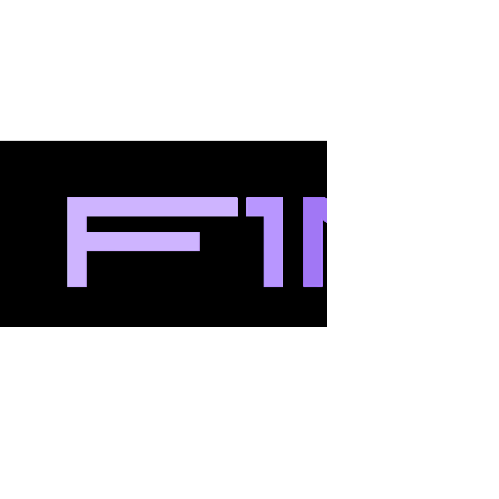

<p align="center">
  <picture>
    <source srcset="app/static/images/favicon.svg" width="200">
    
  </picture>
</p>

<div id="user-content-toc">
  <ul align="center" style="list-style: none;">
    <summary>
      <h1>f1nsight</h1>
    </summary>
  </ul>
</div>
<div id="user-content-toc">
  <ul align="center" style="list-style: none;">
    <summary>
      <h2>a flask website for all your f1 data needs</h2>
    </summary>
  </ul>
</div>

## what is f1nsight for?
f1nsight will serve as a data archive and dashboard for f1 enthusiasts built on a secure architecture, and supported by flask

## features

- informative dashboard with quick access to key information

- historical race data

- driver performance comparison

- driver profiles

- live desktop notifcations

- api sourced news

## prerequisites
- pip

## how to run

clone git repository
```
git clone https://github.com/TempeHS/2025SE_Gianfranco.M_f1nsight
``` 

obtain secret key
```
python
import secrets
secrets.token_hex(16)
```
```
insert secret key in .env file
```

run installation script (creates and sources venv, installs requirements)
```
./installation.sh
```

use python to run app
```
python run.py
```

create profile
```
click register now and create profile adhering to requirements
```

login to profile
```
enter details and login
```

## contact
gmanieli5647@gmail.com - gianfranco, lead dev